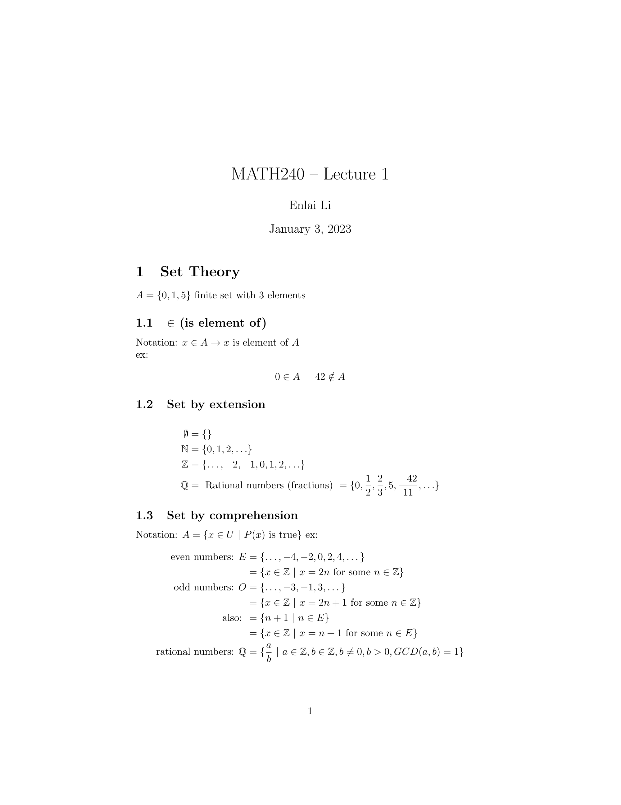

# McGill MATH240 - Discrete Structures Notes
This repository contains my McGill MATH240 notes. They are in the order of the lectures and are written in Markdown. A rendered PDF version is also available.

## Tools Used
The PDF files are generated from Markdown using PrinceXML. The math expressions are rendered using Katex.